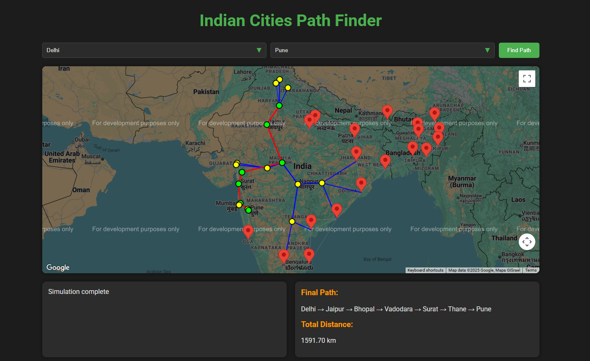

# Shortest Path Finder using City Network (DSA)

  

## Description  
A **pathfinding application** built using **A\* Algorithm** and **Dijkstra’s Algorithm** in **JavaScript** to calculate the shortest distance between cities.  
The project integrates **Google Maps API** to visualize routes and estimate costs using real-world weighted city network data.

## Tools & Technologies  
- **Google Maps API** – For route visualization and real-world data.  
- **A\* Algorithm** – Optimized pathfinding.  
- **Dijkstra’s Algorithm** – Shortest path calculation.  
- **JavaScript** – Core logic and interactivity.  
- **HTML & CSS** – Interface design.  

## Features  
- Shortest path calculation between cities.  
- Real-world visualization of routes using Google Maps API.  
- Cost estimation based on distance and weight.  
- Implementation of fundamental **DSA algorithms** (A\* and Dijkstra’s).  

